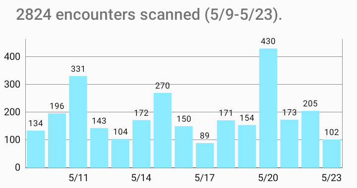

# corona-warn-companion-android
Android App Which Shows Details about CWA Exposures (Requires Root)

  

© 2020-2022  Michael Huebler and other contributors.
This program is distributed in the hope that it will be useful, but WITHOUT ANY WARRANTY; without even the implied warranty of MERCHANTABILITY or FITNESS FOR A PARTICULAR PURPOSE.  See the GNU General Public License for more details.

---
Deutsche Anleitungen z.B. hier: 
- c't 6/2022 S. 152: https://www.heise.de/select/ct/2022/6/2202010261560076939 
- heise online: https://www.heise.de/hintergrund/Wie-Sie-verborgene-Daten-aus-der-Corona-Warn-App-herauskitzeln-6363619.html
- sbamueller: https://sbamueller.com/2022/01/21/von-wo-habe-ich-den-nun-die-rote-kachel-in-der-corona-warn-app/
---

# How to install the app

There are 3 options:

### 1. Get the app from the Play Store
1. Download from https://play.google.com/store/apps/details?id=org.tosl.warnappcompanion
2. Write a short review

### 2. Install a release from GitHub
1. Download the latest released APK from the Assets at https://github.com/mh-/corona-warn-companion-android/releases 
2. Install via `adb` tool and USB cable: `adb install corona-warn-companion-github-release.apk`

### 3. Build the app from source code, using Android Studio
1. `git clone https://github.com/mh-/corona-warn-companion-android.git`
2. In Android Studio, select a 'flavor': 
`github` is the normal version, called "Corona-Warn-Companion". 
`playstore` is a version that was renamed to "Warn-App-Companion" because of the Play Store requirements for COVID-19 apps;
this is not a _category 1 or 2_ app and must therefore not use COVID-19 related terms in its Play Store listing.
3. Build the `debug` build variant, and install it on your device. 
The `release` build variant will probably build out-of-the box only on macOS because of the way how the keystore for app signing is accessed.

# How to use the app
After a lot of user feedback and many iterations, the app meanwhile has several modes. 
The best user experience is available if the device is rooted and the app gets root permissions: With root permissions, the app can directly access the database _from a framework_ where the recorded Rolling Proximity IDs (RPIs) are stored.

However, since many users cannot or do not wish to root their device, other options (RaMBLE and CCTG) are also available, where _another app_ can export their recorded RPIs, so that this app can read them without root rights, and work with them.

The currently available modes are:

## Modes that require root permissions:

### Normal mode (root):
This app reads RPIs from the Google Exposure Notifications service / framework. Works together with the official [Corona-Warn-App](https://www.coronawarn.app/de/).

### microG mode (root):
This app reads RPIs from the [microG ENF framework](https://microg.org). This works if you have installed microG and an app that activates microG ENF RPI recording, and give root access to this app.

## Modes that work without root:

### CCTG Export (this is not a special mode within this app, use 'sharing' from CCTG to activate this):
This requires the installation of the [Corona Contact Tracing Germany app](https://bubu1.eu/cctg/). On the next day, export the tracing information from CCTG and *share* with this app as described in the [CCTG FAQ](https://codeberg.org/corona-contact-tracing-germany/cwa-android#how-do-i-access-the-microg-exposure-notitifaction-settings-in-the-standalone-app). If you tap "export" on the microG ENF screen, and select to *share* with this app (tap on the Friendly Dog icon), this app is called and automatically reads the data, and also automatically selects "microG mode" in the process.

Note that the next time you want to use this app, you need to follow the same steps again (export and share from CCTG / microG ENF).

### CCTG Import:
*NOTE: It's easier to use the CCTG Export (as explained above) instead*

This app can read RPIs from a file created by the [Corona Contact Tracing Germany app](https://bubu1.eu/cctg/) (which brings its own microG framework that stores the RPIs in its own location: /data/data/de.corona.tracing/databases/exposure.db). Works if you have installed CCTG and if you can copy the database file to a location where you can select it from within this app - e.g. by doing 
`adb shell su -c cp /data/data/de.corona.tracing/databases/exposure.db /storage/emulated/0/Download/`.
One thing you can also do using this mode: 
Use a **copy of a database file** that was copied from a slow device, where analysis takes very long, on another more capable device, where analysis runs faster.

### RaMBLE Import:
This mode requires the installation of the [RamBLE - Bluetooth LE Mapper app](https://apkpure.com/de/ramble-bluetooth-le-mapper/com.contextis.android.BLEScanner).

You need to record with the [RaMBLE app](https://apkpure.com/de/ramble-bluetooth-le-mapper/com.contextis.android.BLEScanner) (to record, tap the "▶" button). 
And then on the next day, export the database (tap the "⋮" button in the top right corner, select "Export Database"). Then set this app to RaMBLE Mode (tap the "⋮" menu button in the top right corner, select "RaMBLE Mode"). *You then need to select the newest "RaMBLE_..." file from the "Downloads" directory*, where RaMBLE has stored its exported database.

Note that the next time you want to use this app, you need to follow the same steps again (export from RaMBLE, select the file in this app).

Note that the Exposure Notifications database contains `calibrated_rssi` ([see here](https://developers.google.com/android/exposure-notifications/ble-attenuation-overview#calibration_per-device_tx_power_and_per-device_rssi_correction)).
RaMBLE however stores only `raw_rssi`, which means that the colors shown on the details screen are probably different from the case when the app reads the Exposure Notifications database.

---
(BTW, if you wonder why this explanation is not part of the Play Store text: This is because of the Play Store requirements for COVID-19 apps; this is not a category 1 or 2 app and must therefore not use COVID-19 related terms in its Play Store listing.)

---

# Features
This app helps you to better understand warnings of the official Corona-Warn-App (or its CCTG fork).

**ATTENTION:** To access the same recorded encounters as the official Corona-Warn-App, this app requires ROOT permissions. Without root permissions, the app can only be used together with the RaMBLE app, or with the CCTG app / microG. Please read the "How to use the app" section above.

### What the app does:
1. The app reads the Rolling Proximity IDs recorded by your device from the Exposure Notifications database 
   (this is only possible with root permissions, which is why official Exposure Notifications apps, such as Corona-Warn-App,
   cannot display these details).  
   
   Alternatively, without root permissions, the app can also read a database exported from the [RaMBLE - Bluetooth LE Mapper app](https://apkpure.com/de/ramble-bluetooth-le-mapper/com.contextis.android.BLEScanner), or from the [CCTG Corona Contact Tracing Germany app](https://f-droid.org/de/packages/de.corona.tracing/) / microG.
2. The app downloads the Diagnosis Keys from the official German Corona-Warn-Server and other countries' servers, as selected by you.
   For Germany, it downloads the keys published daily for the last few days, and the keys published every hour for today. 
   Only keys for the days found in step 1 are shown and counted.  
   
3. The app compares both in order to find matches (risk encounters).  
   

If risk encounters are found, it shows the details:
At which times and with which radio attenuation (roughly corresponds to the distance) did the encounters take place, and what level of transmission risk did the encounters have.
For encounters that were recorded by RaMBLE, it can also display the location.

Note that 1 means a low and 8 means a high transmission risk.

### What the app does not do:
- The app does not process any personal data.
- The app only accesses the internet for the purpose 2 (see above), i.e. it only downloads data from the official warning servers and does not send any data to other servers (unless you ask it to show the location of an encounter, in which case it will contact OpenStreetMap servers).
- The app does not show any advertising.

# Open Source
The source code of the app is published at https://github.com/mh-/corona-warn-companion-android, so you can check the source code, build the app yourself, and you are also welcome to contribute to improvements.

# Countries covered
Download from the German server: 
🇩🇪 Germany, 🇧🇪 Belgium, 🇩🇰 Denmark, 🇪🇪 Estonia, 🇫🇮 Finland, 🇮🇪 Ireland, 🇮🇹 Italy, 🇭🇷 Croatia, 🇱🇻 Latvia, 🇱🇹 Lithuania, 🇲🇹 Malta, 🇳🇱 Netherlands, 🇳🇴 Norway, 🇵🇱 Poland, 🇸🇮 Slovenia, 🇨🇭 Switzerland, 🇪🇸 Spain

Download from the respective country's server:
- Belgium
- Canada
- Netherlands
- Poland
- Switzerland
- England and Wales

In the top right hand corner of the app is a menu button, 
please use this to select the countries from which you want to download Diagnosis Keys.

Please note that we mainly follow changes that happen in the German CWA setup; if you experience problems with another country, 
please let us know via a GitHub issue.

# Other
- The app is used for private purposes only, it is not used for any business purposes.
- The app is not a "hacking tool". It only reads data from the memory of your own device, which is stored there without additional encryption.
